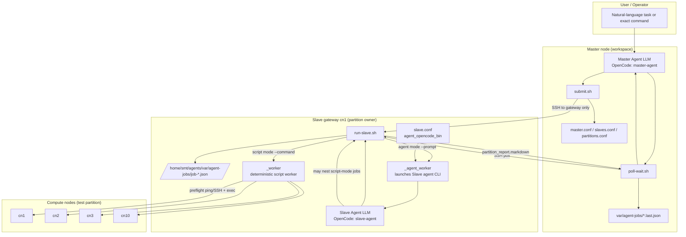
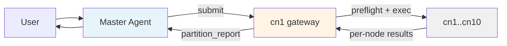
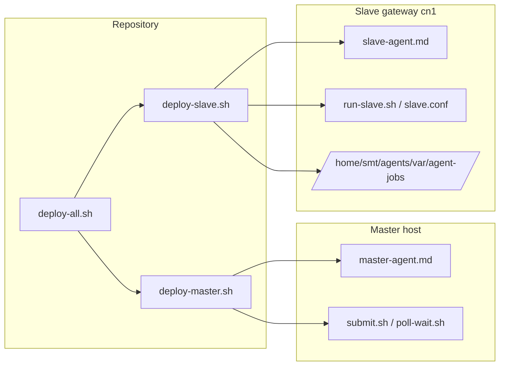
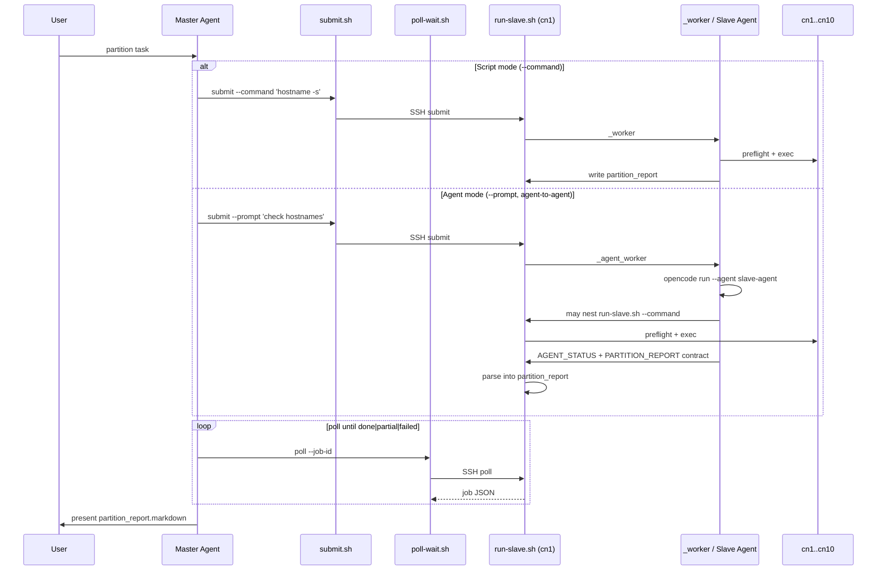

# Architecture

**中文：** [`docs/zh/architecture.md`](zh/architecture.md)

Master/Slave agent control plane for async partition execution. Master delegates to Slave gateways; Slave owns preflight, execution, and the centralized `partition_report`.

## Overview

| Layer | Host | Role |
|-------|------|------|
| **Master** | Local workspace (or remote Master host) | Orchestrator: `submit.sh` → `poll-wait.sh` → present `partition_report` |
| **Slave gateway** | e.g. `cn1` | Partition owner for `test` → `cn[1-10]` |
| **Compute nodes** | `cn1`–`cn10` | Execution targets (preflight + exec from gateway only) |

**Hard rule:** Master SSHs **only to the gateway**, never directly to compute nodes for partition work.

---

## Full architecture



---

## Simplified: data flow



**Job JSON** is the contract between Master and gateway:

```
submit.sh  ──SSH──►  run-slave.sh submit  ──►  /home/smt/agents/var/agent-jobs/<job_id>.json
poll-wait.sh    ──SSH──►  run-slave.sh poll    ◄──  same JSON (+ partition_report at end)
```

Master caches the latest poll in `var/agent-jobs/<job_id>.last.json`.

---

## Simplified: deployment



```bash
./scripts/deploy/deploy-all.sh cn1          # Master (local) + Slave (cn1)
./scripts/deploy/deploy-master.sh           # Master only
./scripts/deploy/deploy-slave.sh cn1        # Slave only
```

| Side | OpenCode default |
|------|------------------|
| Master | `master-agent` |
| Slave (cn1) | `slave-agent` |

---

## Delegation modes



| Mode | Flag | Gateway executor | When to use |
|------|------|------------------|-------------|
| **Script** | `--command '<cmd>'` | `_worker` (deterministic) | Exact command known; fast path |
| **Agent** | `--prompt '<task>'` | Slave agent LLM via OpenCode CLI | Judgment, diagnosis, multi-step |

Both modes produce the same `partition_report` in job JSON; Master reporting flow is identical.

---

## Runtime selection (Slave, agent mode only)

Agent mode always uses OpenCode: `opencode run --agent slave-agent`.

Config in `slave/config/slave.conf`:

```ini
agent_opencode_bin opencode
agent_opencode_agent slave-agent
```

---

## Responsibility boundary

| Layer | Does | Does not |
|-------|------|----------|
| **Master Agent** | Submit to gateway, poll job, present `partition_report.markdown` | SSH/exec on cn2–cn10; assemble node status from raw `nodes.*` |
| **Slave gateway** | Preflight, node exclusion, exec, centralized report | Operate outside owned partition |
| **Script mode** | Deterministic per-node run | LLM reasoning |
| **Agent mode** | Slave LLM plans and reports | As fast as script mode |

---

## File map

```
Master (workspace)                    Slave gateway (cn1)
────────────────────────────────────────────────────────────────
master/.opencode/agents/master-agent.md (Master only)
opencode.json (master-agent)
master/config/master.conf
master/scripts/{submit,poll,poll-wait}.sh
shared/{partitions,slaves}.conf

slave/              →   deployed flat to /home/smt/agents/ via deploy-slave.sh
  .opencode/        →   .opencode/
  opencode.json     →   opencode.json
  config/slave.conf →   config/slave.conf
  scripts/run-slave.sh → scripts/run-slave.sh
  scripts/preflight/   → scripts/preflight/
  shared/              → shared/

master/scripts/submit.sh      SSH →    (Master only)
master/scripts/poll-wait.sh  SSH →    scripts/run-slave.sh wait (blocks until terminal)
                                     scripts/run-slave.sh submit / _worker / _agent_worker
var/agent-jobs/*.last.json  ←──      /home/smt/agents/var/agent-jobs/*.json
```

---

## Config routing (test partition)

| File | Example | Purpose |
|------|---------|---------|
| `shared/partitions.conf` | `test cn[1-10]` | Logical partition → nodeset |
| `shared/slaves.conf` | `cn1 test cn[1-10]` | Gateway registry |
| `master/config/master.conf` | `default_gateway cn1` | Master defaults, poll backoff |
| `slave/config/slave.conf` | `agent_opencode_bin opencode` | Exclusion policy + agent CLI |

```bash
./master/scripts/list-slaves.py --partition test   # → cn1
```

---

## One-line summary

**Master talks only to the gateway; the gateway (Slave agent or deterministic worker) owns the whole partition and returns one `partition_report` — same job JSON and poll protocol for both script and agent modes.**
