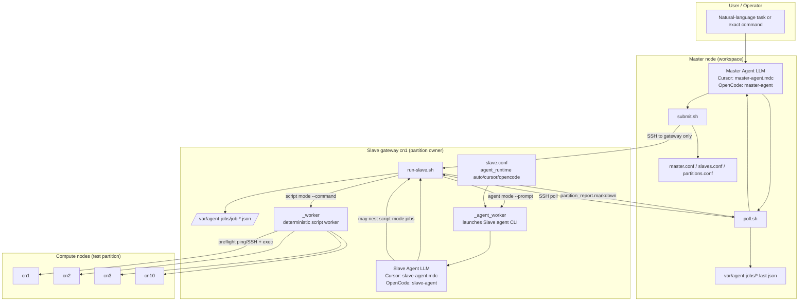
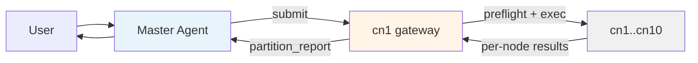
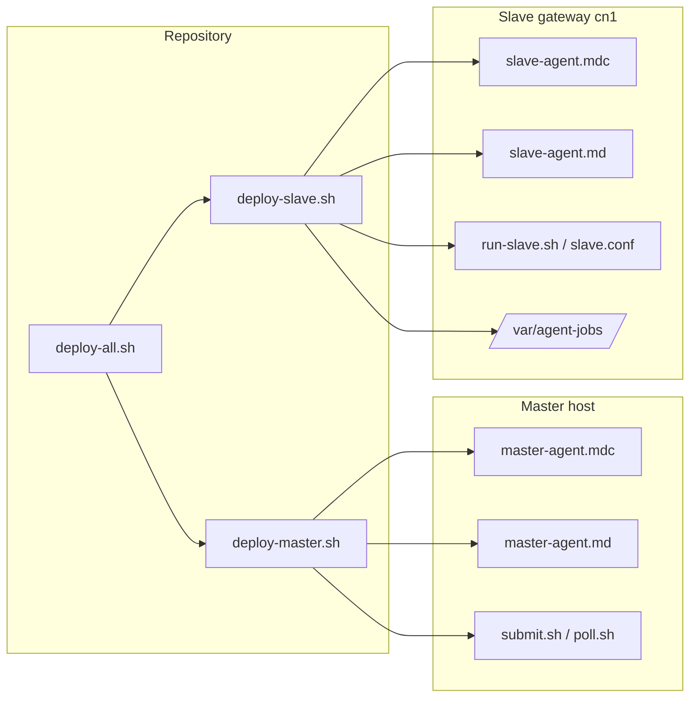
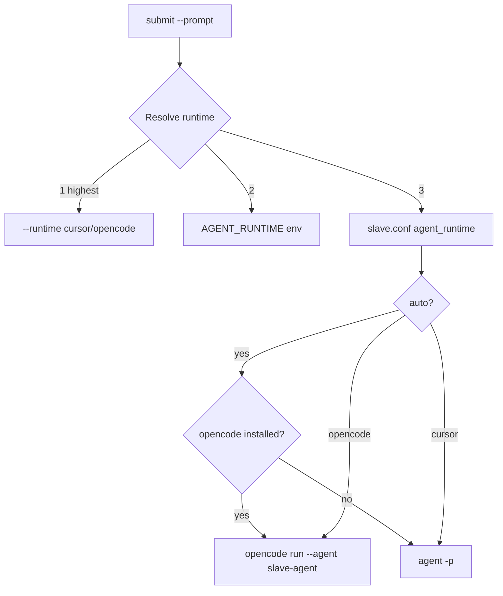

# Architecture

**中文：** [`docs/zh/architecture.md`](zh/architecture.md)

Master/Slave agent control plane for async partition execution. Master delegates to Slave gateways; Slave owns preflight, execution, and the centralized `partition_report`.

## Overview

| Layer | Host | Role |
|-------|------|------|
| **Master** | Local workspace (or remote Master host) | Orchestrator: `submit.sh` → `poll.sh` → present `partition_report` |
| **Slave gateway** | e.g. `cn1` | Partition owner for `test` → `cn[1-10]` |
| **Compute nodes** | `cn1`–`cn10` | Execution targets (preflight + exec from gateway only) |

**Hard rule:** Master SSHs **only to the gateway**, never directly to compute nodes for partition work.

---

## Full architecture



---

## Simplified: data flow



**Job JSON** is the contract between Master and gateway:

```
submit.sh  ──SSH──►  run-slave.sh submit  ──►  /var/agent-jobs/<job_id>.json
poll.sh    ──SSH──►  run-slave.sh poll    ◄──  same JSON (+ partition_report at end)
```

Master caches the latest poll in `var/agent-jobs/<job_id>.last.json`.

---

## Simplified: deployment



```bash
./scripts/jobs/deploy-all.sh cn1          # Master (local) + Slave (cn1)
./scripts/jobs/deploy-master.sh           # Master only
./scripts/jobs/deploy-slave.sh cn1        # Slave only
```

| Side | OpenCode default | Cursor rule |
|------|------------------|-------------|
| Master | `master-agent` | `~/.cursor/rules/master-agent.mdc` |
| Slave (cn1) | `slave-agent` | `~/.cursor/rules/slave-agent.mdc` |

---

## Delegation modes

```mermaid
sequenceDiagram
  participant User as User
  participant MA as Master Agent
  participant SS as submit.sh
  participant PS as poll.sh
  participant RS as run-slave.sh (cn1)
  participant Exec as _worker / Slave Agent
  participant Node as cn1..cn10

  User->>MA: partition task
  alt Script mode (--command)
    MA->>SS: submit --command 'hostname -s'
    SS->>RS: SSH submit
    RS->>Exec: _worker
    Exec->>Node: preflight + exec
    Exec->>RS: write partition_report
  else Agent mode (--prompt, agent-to-agent)
    MA->>SS: submit --prompt 'check hostnames'
    SS->>RS: SSH submit
    RS->>Exec: _agent_worker
    Exec->>Exec: Cursor agent -p or opencode run --agent slave-agent
    Exec->>RS: may nest run-slave.sh --command
    RS->>Node: preflight + exec
    Exec->>RS: AGENT_STATUS + PARTITION_REPORT contract
    RS->>RS: parse into partition_report
  end
  loop poll until done|partial|failed
    MA->>PS: poll --job-id
    PS->>RS: SSH poll
    RS-->>PS: job JSON
  end
  MA->>User: present partition_report.markdown
```



| Mode | Flag | Gateway executor | When to use |
|------|------|------------------|-------------|
| **Script** | `--command '<cmd>'` | `_worker` (deterministic) | Exact command known; fast path |
| **Agent** | `--prompt '<task>'` | Slave agent LLM via CLI | Judgment, diagnosis, multi-step |

Both modes produce the same `partition_report` in job JSON; Master reporting flow is identical.

---

## Runtime selection (Slave, agent mode only)



Config in `scripts/jobs/slave.conf`:

```ini
agent_runtime auto
agent_cursor_bin /root/.local/bin/agent
agent_opencode_bin opencode
agent_opencode_agent slave-agent
```

---

## Responsibility boundary

| Layer | Does | Does not |
|-------|------|----------|
| **Master Agent** | Submit to gateway, poll job, present `partition_report.markdown` | SSH/exec on cn2–cn10; assemble node status from raw `nodes.*` |
| **Slave gateway** | Preflight, node exclusion, exec, centralized report | Operate outside owned partition |
| **Script mode** | Deterministic per-node run | LLM reasoning |
| **Agent mode** | Slave LLM plans and reports | As fast as script mode |

---

## File map

```
Master (workspace)                    Slave gateway (cn1)
────────────────────────────────────────────────────────────────
.cursor/rules/master-agent.mdc   →   (not deployed to slave)
.opencode/agents/master-agent.md      (Master only)
opencode.json (master-agent)

deploy/slave-agent/              →   deployed via deploy-slave.sh
  .cursor/rules/slave-agent.mdc  →   ~/.cursor/rules/slave-agent.mdc
  .opencode/agents/slave-agent.md →  .opencode/agents/slave-agent.md
  opencode.json (slave-agent)    →   opencode.json

scripts/jobs/submit.sh      SSH →    (Master only)
scripts/jobs/poll.sh        SSH →    run-slave.sh poll
                                     run-slave.sh submit / _worker / _agent_worker
                                     slave.conf
var/agent-jobs/*.last.json  ←──      /var/agent-jobs/*.json
```

---

## Config routing (test partition)

| File | Example | Purpose |
|------|---------|---------|
| `partitions.conf` | `test cn[1-10]` | Logical partition → nodeset |
| `slaves.conf` | `cn1 test cn[1-10]` | Gateway registry |
| `master.conf` | `default_gateway cn1` | Master defaults, poll backoff |
| `slave.conf` | `agent_runtime auto` | Exclusion policy + agent CLI |

```bash
./scripts/jobs/list-slaves.py --partition test   # → cn1
```

---

## One-line summary

**Master talks only to the gateway; the gateway (Slave agent or deterministic worker) owns the whole partition and returns one `partition_report` — same job JSON and poll protocol for both script and agent modes.**
