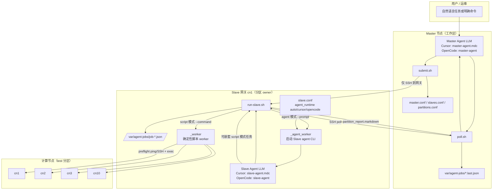
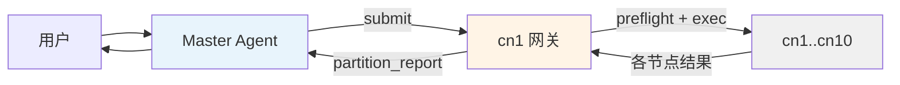
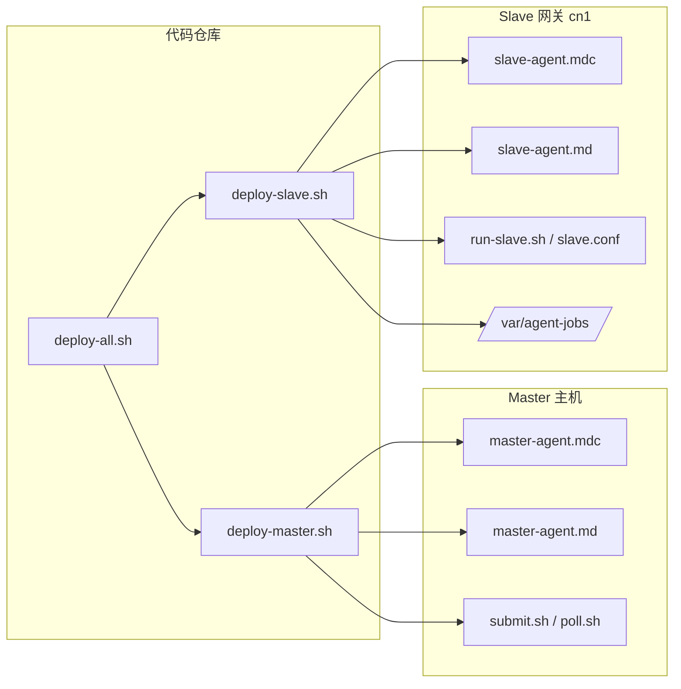
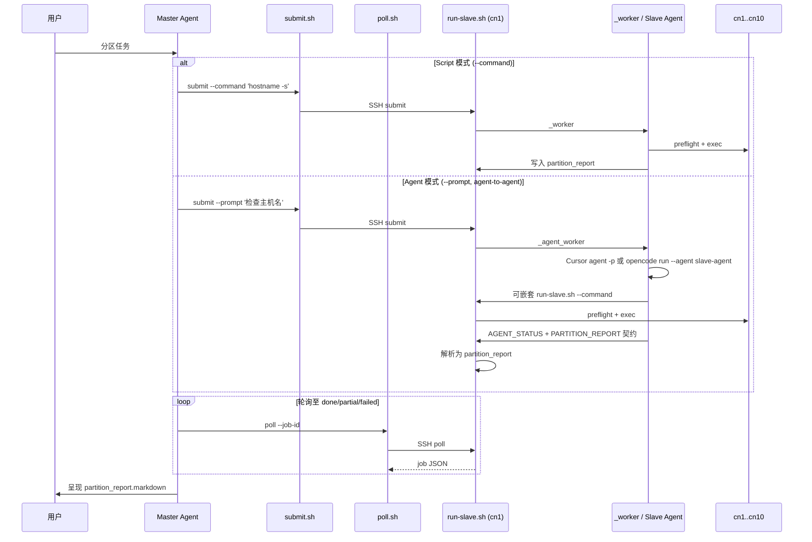
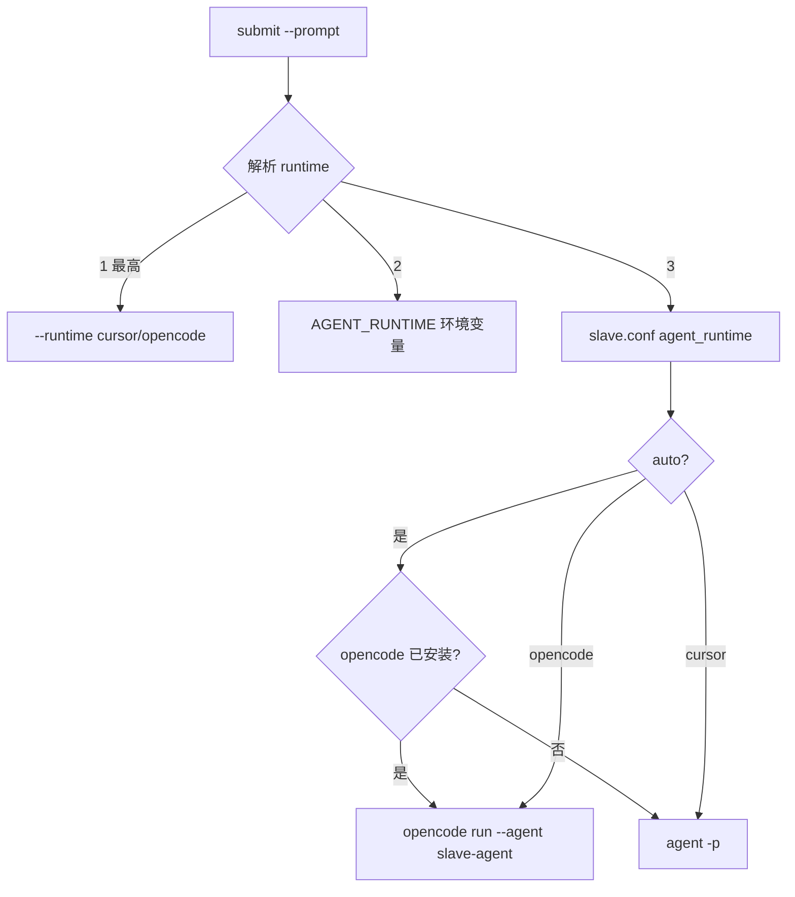

# 架构说明

**English:** [`docs/architecture.md`](../architecture.md)

Master/Slave 双 Agent 控制面：Master 委托 Slave 网关异步执行分区任务；Slave 负责 preflight、执行与集中式 `partition_report`。

## 总览

| 层级 | 主机 | 职责 |
|------|------|------|
| **Master** | 本机工作区（或远程 Master 主机） | 编排：`submit.sh` → `poll.sh` → 呈现 `partition_report` |
| **Slave 网关** | 如 `cn1` | 分区 owner，管理 `test` → `cn[1-10]` |
| **计算节点** | `cn1`–`cn10` | 执行目标（仅由网关 preflight + exec） |

**硬性约束：** Master 对分区任务 **只 SSH 到网关**，不直接操作计算节点。

---

## 完整架构



---

## 简化：数据流



**Job JSON** 是 Master 与网关之间的契约：

```
submit.sh  ──SSH──►  run-slave.sh submit  ──►  /var/agent-jobs/<job_id>.json
poll.sh    ──SSH──►  run-slave.sh poll    ◄──  同一 JSON（结束时含 partition_report）
```

Master 将最新 poll 缓存在 `var/agent-jobs/<job_id>.last.json`。

---

## 简化：部署



```bash
./scripts/jobs/deploy-all.sh cn1          # Master（本机）+ Slave（cn1）
./scripts/jobs/deploy-master.sh           # 仅 Master
./scripts/jobs/deploy-slave.sh cn1        # 仅 Slave
```

| 端 | OpenCode 默认 agent | Cursor 规则 |
|----|---------------------|-------------|
| Master | `master-agent` | `~/.cursor/rules/master-agent.mdc` |
| Slave（cn1） | `slave-agent` | `~/.cursor/rules/slave-agent.mdc` |

---

## 委托模式



| 模式 | 参数 | 网关执行者 | 适用场景 |
|------|------|------------|----------|
| **Script** | `--command '<cmd>'` | `_worker`（确定性） | 命令明确；快路径 |
| **Agent** | `--prompt '<task>'` | Slave agent LLM | 需判断、诊断、多步骤 |

两种模式产出相同的 `partition_report`；Master 汇报流程一致。

---

## 运行时选择（Slave，仅 agent 模式）



`scripts/jobs/slave.conf` 配置：

```ini
agent_runtime auto
agent_cursor_bin /root/.local/bin/agent
agent_opencode_bin opencode
agent_opencode_agent slave-agent
```

---

## 职责边界

| 层级 | 负责 | 不负责 |
|------|------|--------|
| **Master Agent** | 提交到网关、轮询、呈现 `partition_report.markdown` | SSH/执行 cn2–cn10；从 `nodes.*` 自行拼报告 |
| **Slave 网关** | preflight、节点排除、执行、集中报告 | 越权操作其他分区 |
| **Script 模式** | 确定性 per-node 执行 | LLM 推理 |
| **Agent 模式** | Slave LLM 规划与汇报 | 与 script 同速 |

---

## 文件映射

```
Master（工作区）                      Slave 网关（cn1）
────────────────────────────────────────────────────────────────
.cursor/rules/master-agent.mdc   →   （不部署到 slave）
.opencode/agents/master-agent.md      （仅 Master）
opencode.json (master-agent)

deploy/slave-agent/              →   经 deploy-slave.sh 部署
  .cursor/rules/slave-agent.mdc  →   ~/.cursor/rules/slave-agent.mdc
  .opencode/agents/slave-agent.md →  .opencode/agents/slave-agent.md
  opencode.json (slave-agent)    →   opencode.json

scripts/jobs/submit.sh      SSH →    （仅 Master）
scripts/jobs/poll.sh        SSH →    run-slave.sh poll
                                     run-slave.sh submit / _worker / _agent_worker
                                     slave.conf
var/agent-jobs/*.last.json  ←──      /var/agent-jobs/*.json
```

---

## 配置路由（test 分区）

| 文件 | 示例 | 作用 |
|------|------|------|
| `partitions.conf` | `test cn[1-10]` | 逻辑分区 → 节点集 |
| `slaves.conf` | `cn1 test cn[1-10]` | 网关注册表 |
| `master.conf` | `default_gateway cn1` | Master 默认与轮询策略 |
| `slave.conf` | `agent_runtime auto` | 排除策略 + agent CLI |

```bash
./scripts/jobs/list-slaves.py --partition test   # → cn1
```

---

## 一句话总结

**Master 只跟网关通信；网关（Slave agent 或确定性 worker）拥有整个分区并返回一份 `partition_report` —— script 与 agent 模式共用同一套 job JSON 与 poll 协议。**
