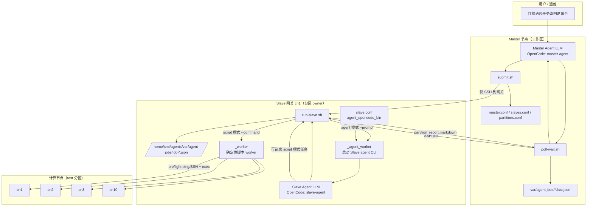
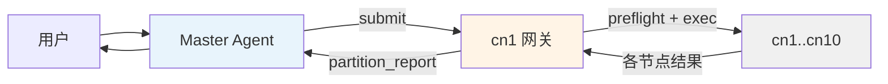
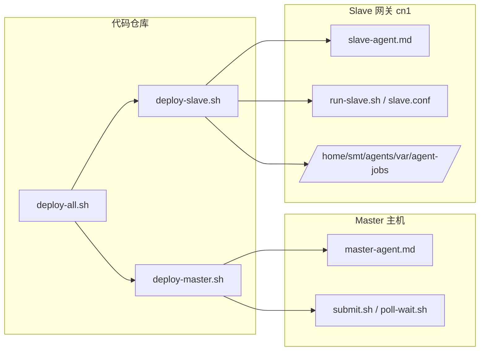
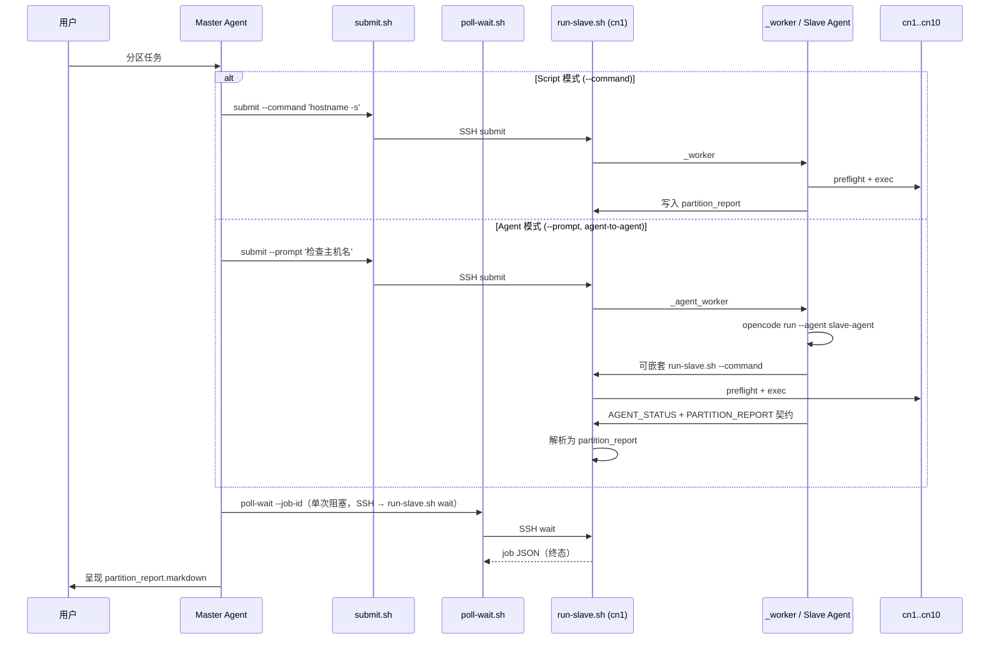

# 架构说明

**English:** [`docs/architecture.md`](../architecture.md)

Master/Slave 双 Agent 控制面：Master 委托 Slave 网关异步执行分区任务；Slave 负责 preflight、执行与集中式 `partition_report`。

## 总览

| 层级 | 主机 | 职责 |
|------|------|------|
| **Master** | 本机工作区（或远程 Master 主机） | 编排：`submit.sh` → `poll-wait.sh` → 呈现 `partition_report` |
| **Slave 网关** | 如 `cn1` | 分区 owner，管理 `test` → `cn[1-10]` |
| **计算节点** | `cn1`–`cn10` | 执行目标（仅由网关 preflight + exec） |

**硬性约束：** Master 对分区任务 **只 SSH 到网关**，不直接操作计算节点。

---

## 完整架构



---

## 简化：数据流



**Job JSON** 是 Master 与网关之间的契约：

```
submit.sh     ──SSH──►  run-slave.sh submit  ──►  /home/smt/agents/var/agent-jobs/<job_id>.json
poll-wait.sh  ──SSH──►  run-slave.sh wait    ◄──  JSON（阻塞至终态后返回，无需多次轮询）
```

`run-slave.sh wait` 在网关侧以递增 backoff（5s→30s）轮询本机 JSON，等 status 到达 `done|partial|failed` 后 `cat` 返回。Master 只需 **一次 SSH 调用**，无需多次轮询。

Master 将最新 poll 缓存在 `var/agent-jobs/<job_id>.last.json`。

---

## 简化：部署



```bash
./scripts/deploy/deploy-all.sh cn1          # Master（本机）+ Slave（cn1）
./scripts/deploy/deploy-master.sh           # 仅 Master
./scripts/deploy/deploy-slave.sh cn1        # 仅 Slave
```

| 端 | OpenCode 默认 agent |
|----|---------------------|
| Master | `master-agent` |
| Slave（cn1） | `slave-agent` |

---

## 委托模式



| 模式 | 参数 | 网关执行者 | 适用场景 |
|------|------|------------|----------|
| **Script** | `--command '<cmd>'` | `_worker`（确定性） | 命令明确；快路径 |
| **Agent** | `--prompt '<task>'` | Slave agent LLM | 需判断、诊断、多步骤 |

两种模式产出相同的 `partition_report`；Master 汇报流程一致。

---

## 运行时选择（Slave，仅 agent 模式）

Agent 模式始终使用 OpenCode：`opencode run --agent slave-agent`。

`slave/config/slave.conf` 配置：

```ini
agent_opencode_bin opencode
agent_opencode_agent slave-agent
```

---

## 职责边界

| 层级 | 负责 | 不负责 |
|------|------|--------|
| **Master Agent** | 提交到网关、轮询、呈现 `partition_report.markdown` | SSH/执行 cn2–cn10；从 `nodes.*` 自行拼报告 |
| **Slave 网关** | preflight、节点排除、执行、集中报告 | 越权操作其他分区 |
| **Script 模式** | 确定性 per-node 执行 | LLM 推理 |
| **Agent 模式** | Slave LLM 规划与汇报 | 与 script 同速 |

---

## 文件映射

```
Master（工作区）                      Slave 网关（cn1）
────────────────────────────────────────────────────────────────
master/.opencode/agents/master-agent.md （仅 Master）
opencode.json (master-agent)
master/config/{master,partitions,slaves}.conf
master/scripts/{submit,poll,poll-wait,list-slaves}

slave/              →   经 deploy-slave.sh 部署为扁平 /home/smt/agents/
  .opencode/        →   .opencode/
  opencode.json     →   opencode.json
  config/slave.conf →   config/slave.conf
  (from Master) partitions.conf → config/partitions.conf
  scripts/run-slave.sh → scripts/run-slave.sh
  scripts/resolve-partition.py → scripts/resolve-partition.py
  scripts/preflight/   → scripts/preflight/

master/scripts/submit.sh      SSH →    （仅 Master）
master/scripts/poll-wait.sh  SSH →    scripts/run-slave.sh wait（阻塞至终态）
                                     scripts/run-slave.sh submit / _worker / _agent_worker
var/agent-jobs/*.last.json  ←──      /home/smt/agents/var/agent-jobs/*.json
```

---

## 配置路由（test 分区）

| 文件 | 示例 | 作用 |
|------|------|------|
| `master/config/partitions.conf` | `test cn[1-10]` | 逻辑分区 → 节点集（SoT；部署到网关） |
| `master/config/slaves.conf` | `cn1 test cn[1-10]` | 网关注册表（仅 Master） |
| `master/config/master.conf` | `default_gateway cn1` | Master 默认与轮询策略 |
| `slave/config/slave.conf` | `agent_opencode_bin opencode` | 排除策略 + agent CLI |

```bash
./master/scripts/list-slaves.py --partition test   # → cn1
```

---

## 一句话总结

**Master 只跟网关通信；网关（Slave agent 或确定性 worker）拥有整个分区并返回一份 `partition_report` —— script 与 agent 模式共用同一套 job JSON 与 poll 协议。**
